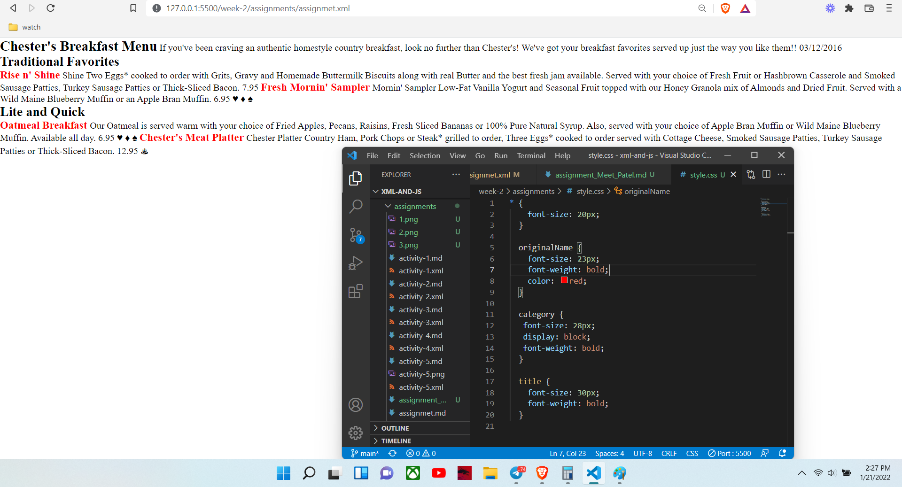

# Assignment 1

# Answers

1. Yes, there is an error, attribute date is causing the error because it has a space in between attributes which is not allowed. by just removing space we can fix the error.

2. CDATA block use for character !, *, -, %, * in the assignment.xml file 

4. There is only one prolog which is in line 1 also menuinfo is a root element in assignment.xml file.
   Also, there are Character Data and Entity References instructions in the document.

5. 
6. 
7. 

<!-- Name: Meet Vishnubhai Patel
Student id: N01490221 -->