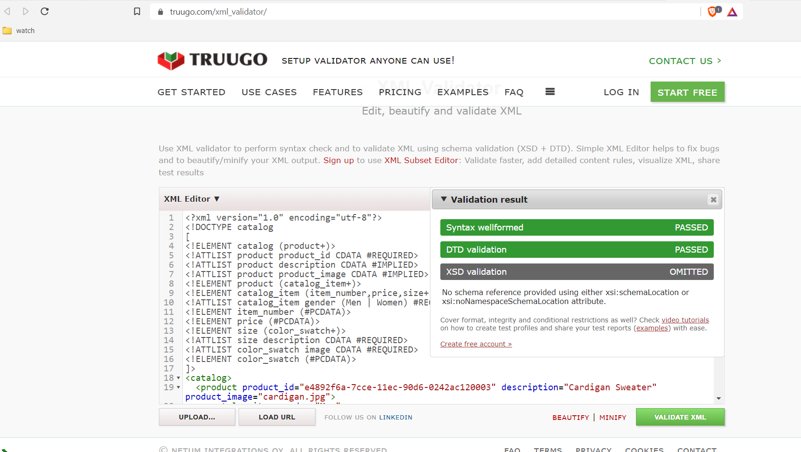
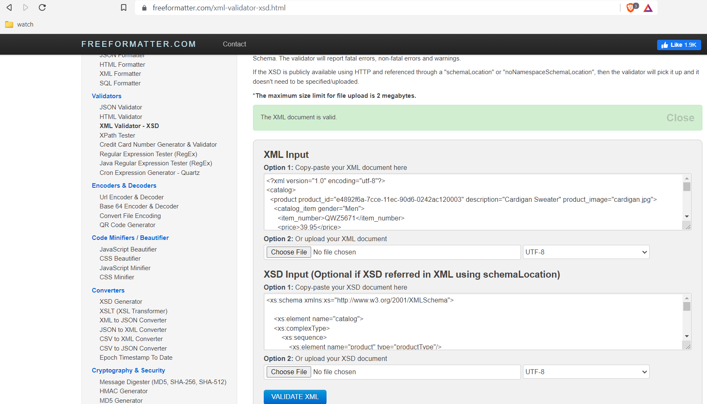

# Assignment N01490221

1. DTD validate:

2. XSD validate: 

3. DTD is easy to understand and also code is a less, whereas XSD is little new and coding is more but is similar to HTML tags also XSD has more options like we can define different datatype, namespace which DTD is not providing.