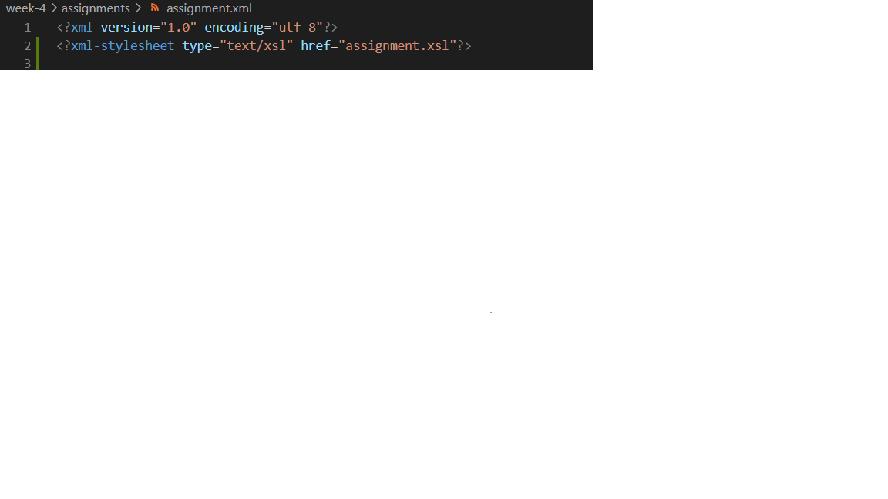
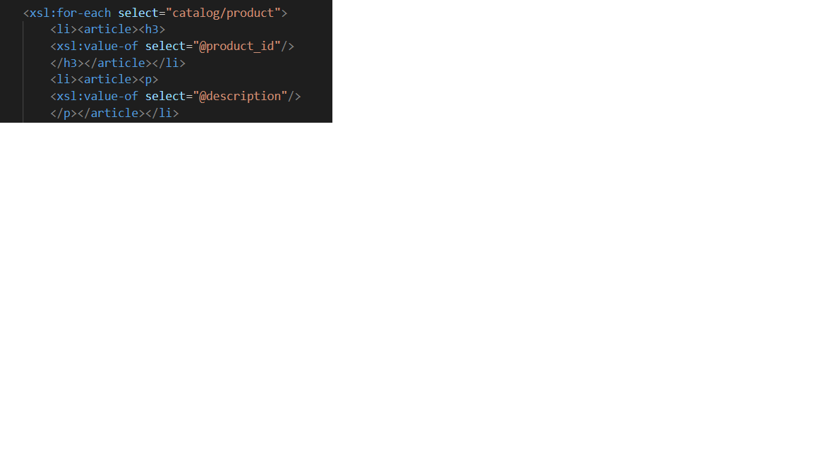
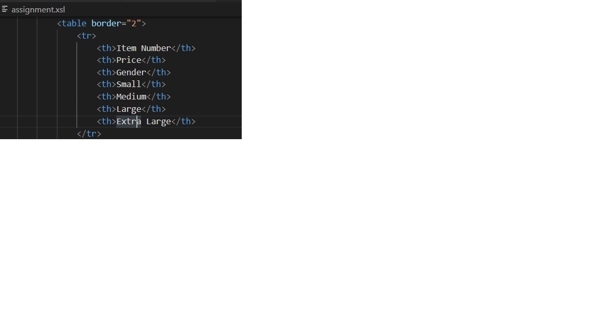
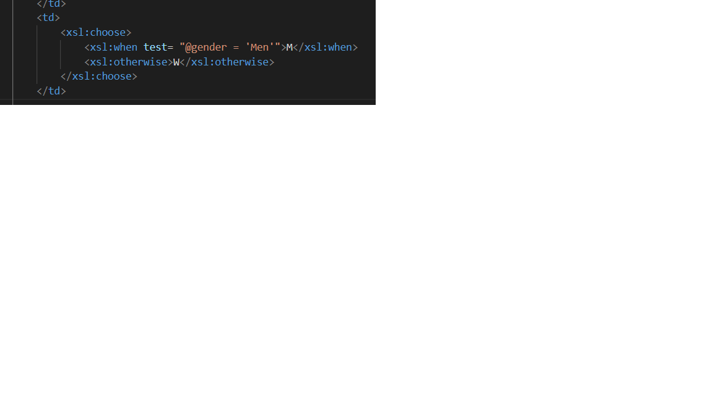
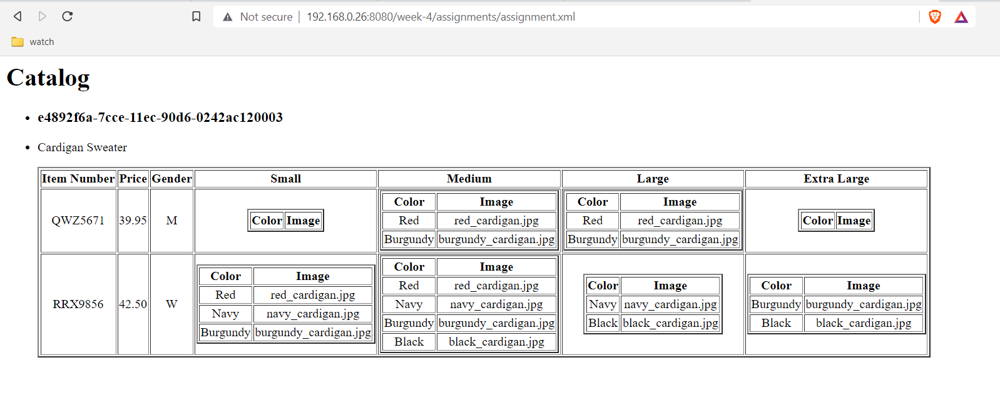

1. I created assignment.xsl file and link it with the orignal file assignment.xml

2. Then I added catalog item and then prodcut_id as well as description of the product as h3 and p linkwise.

3. Then I added table for the catalog_items

4. Then for gender I use choose to show M for male and W for female

5. Output:

